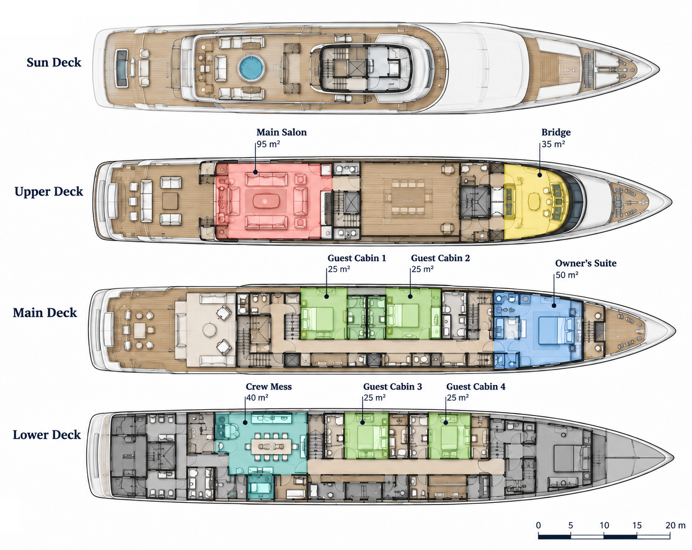

# superyacht-hvac-hvacpy

Concept-level HVAC sizing for a synthetic superyacht accommodation zone, implemented in Python with [`hvacpy`](https://pypi.org/project/hvacpy/), an ASHRAE-based open-source HVAC calculation package.

Covers CLTD/CLF peak zone cooling loads, psychrometric fresh-air AHU sizing, FCU selection per room, chilled-water plant sizing with N+1 redundancy, concept duct sizing, a winter heating check, and an independent supplier-proposal verification.

## Result summary

| Quantity | Value |
|---|---|
| Peak zone cooling load | 17.8 kW (14:00) |
| Fresh-air AHU duty | 19.5 kW (0.38 m³/s, 32 occupants) |
| Combined plant load | 36.9 kW |
| Chiller plant | 3 × 20.3 kW, N+1, COP 5.5 |
| Condenser heat rejection | 43.6 kW |
| Main duct | 350 mm dia., 3.9 m/s, 0.52 Pa/m |
| Winter heating load | 5.8 kW |
| Supplier-proposal check | 3 of 3 requirements met |

## Contents

- [`superyacht_hvac_concept_minimal.ipynb`](superyacht_hvac_concept_minimal.ipynb) — the calculation
- [`theory.md`](theory.md) — plain-language walkthrough of the engineering logic

## Scope

All geometry, loads, and equipment figures are synthetic inputs for a portfolio exercise, not a real yacht design. The deck plan above illustrates the same eight spaces modeled in the notebook (Main Salon, Owner's Suite, four Guest Cabins, Bridge, Crew Mess).
